# Dependency Parsing

## Linguistic structure

-   Phrase structure grammar
    -   := context-free grammars
    -   unit := vertex of the tree
    -   ```
        NP -> Det N
            | Det Adj N
        ```
-   Dependency structure

    -   
        -   `[ ]` := sub unit
            -   either `{[ ]}` or `[] {}`, not allow `[ { ] }`?
        -   if a node has at least a child, the node itself could not be separated alone as a unit.
        -   valid units:
            -   `in kitchen`
                -   position
            -   `the kitchen`
                -   which kitchen
            -   `in the kitchen`
                -   position + which
            -   `in crate`
                -   position
            -   `the crate`
                -   which one
            -   `large crate`
                -   size
            -   `crate in the kitchen`
            -   `crate by the door`

-   Human communicate complex ideas by including words in structure.
-   Aim: `unit --{what connnects}-- other unit`.

## Ambiguity

### Prepositional phrase attachment Ambiguity

Prepositional phrase could be attached to different tokens.


```
                        kill
                 (subj)/    \(obj)   \ (nmod)
                      /      \         \
                   cops       man      knife
            /     /                  /
          /      /                  /
       San    Jose                 with
```

... cops using a knife to kill a man.

vs.

```
                        kill
                       /    \
                      /      \
                   cops       man
            /     /                 \ (nmod)
          /      /                    \
       San    Jose                    knife
                                     /
                                    /
                                   with
```

... cops kill the man who was holding a knife.


-   exponential choices -> a lot of ambiguities

### Coordination scope ambiguity

Tokens of both sides around `and`, `or` or `,` want to govern the whole subtree.


```
Shuttle veteran and longtime NASA executive Fred Gregory appointed to board
```

```
                                                         appointed
                                                   /                  \
                                            Fred Gregory              board
             /                                                       /
        veteran                                                    to
       /                         \
Shuttle                           executive
                   /              /
                and          NASA
                           /
                    longtime
```

```
                                                         appointed
              /                                                       \
        veteran                                                       board
       /                                     \                       /
Shuttle                                     Fred Gregory           to
                   /                        /
                and               executive
                                 /
                             NASA
                            /
                    longtime
```


```
No heart, cognitive issues
```

```
                    issues
       /
   heart
  /      \
No        cognitive
         /
        ,
```

-   `,` := or.

```
   heart
  /                 \
No                  issues
         /         /
        , cognitive
```

-   `,` := and.

### Adjectival modifier ambiguity

Adjective attached to different tokens.


```
Students get first hand job experience
```

```
         get
        /                  \
Students                    experience
                       /   /
                   hand job
           (amod) /
             first
```

-   `amod` := adjective modifier

```
         get
        /                  \
Students                    experience
                  /        /
             first      job
                       /
                   hand
```

### Verb Phrase (VP) attachment ambiguity

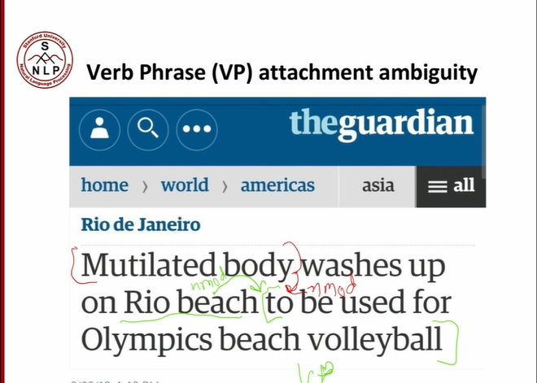

```
Mutilated body washes up on Rio beach
```

-   `... to VP`.

## Dependency Grammar

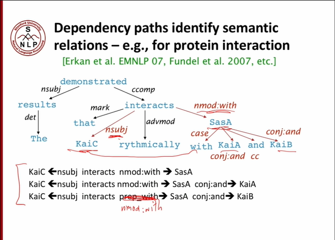

-   Linear: `The results demonstrated that KaiC interacts rhythmically with SasA KaiA and KaiB`.
-   information units:
    -   `KaiC interacts SasA`
    -   `KaiC interacts SasA KaiA`
    -   `KaiC interacts SasA KaiB`
-   `nsubj` := nominal subject
-   `det` := determiner
-   `nmod` := nominal modifier
-   `ccomp` := clausal complement
-   `cc` := Coordinating Conjunction
-   `nn` := Common noun (singular noun)
-   `nns` := plural noun
-   `nnp` := Proper Noun
-   `jj` := adjective
-   `case` := "Case" is a linguistics term regarding a manner of categorizing nouns, pronouns, adjectives, participles, and numerals according to their traditionally corresponding grammatical functions within a given phrase, clause, or sentence.

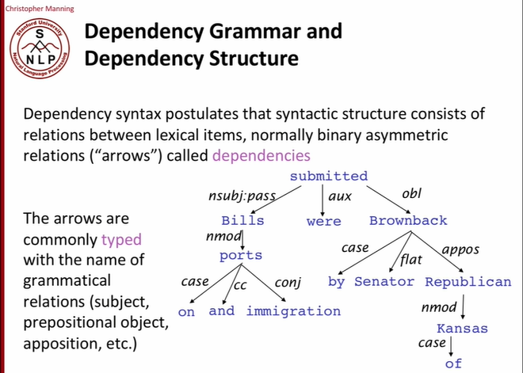

-   `aux` := Auxiliary, a helping element, typically a verb, that adds meaning to the basic meaning of the main verb in a clause.

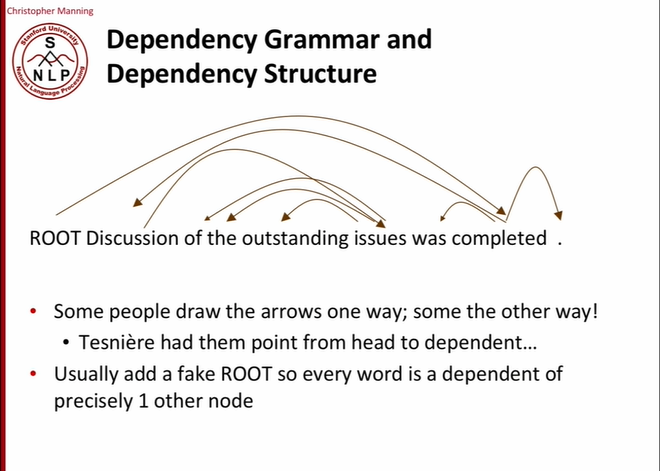

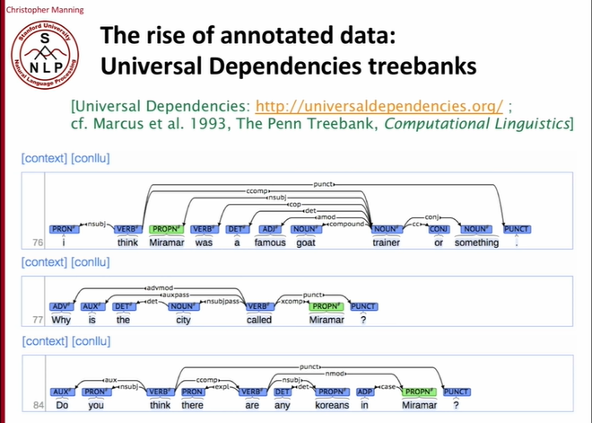

-   Universal Dependencies
    -   corpus
    -   <https://universaldependencies.org/>
    -   unify all grammar structures -> become standard.
    -   authorize on ambiguity

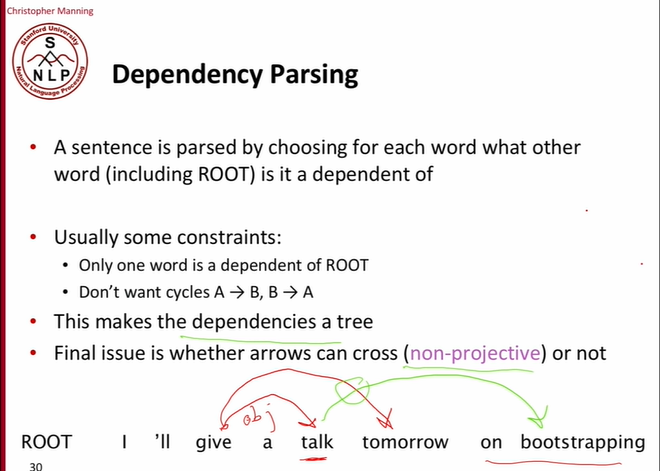

-   if non-projection is not allowed, modify:
    -   `I'll give a talk on bootstrapping tomorrow.`

## Parsing

### Transition based parsing

Arc-standard transition-based parser:

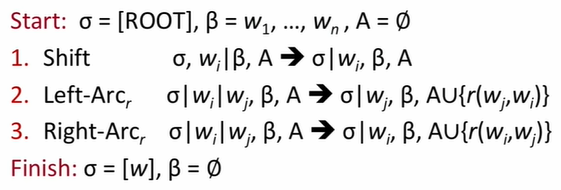

-   `A` := dependencies.
-   $\sigma$ := stack.
-   $\beta$ := buffer.

Parsing:

1. 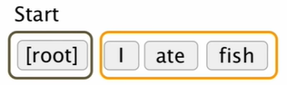
    - dark frame := stack.
    - yellow frame := buffer.
    - only `[root]` is on the stack -> shift.
1. 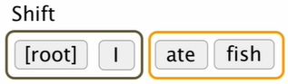
    - check if `I` depends on `[root]` -> false -> shift.
1. 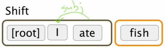
    - find dependency in stack that `stack[1] <- stack[2]` -> reduction -> Left-Arc.
1. 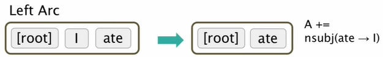
    - remove dependent from stack and add dependency to `A`.
    - could have had a reduction again saying `[root] -> ate`, but there is `fish` on the buffer that `ate -> fish` -> shift.
1. 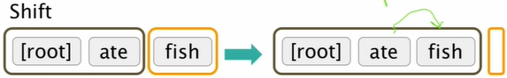
    - find dependency in stack that `stack[1] -> stack[2]` -> reduction -> Right-Arc.
1. 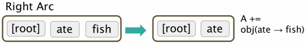
    - remove dependent from stack and add dependency to `A`.
    - find dependency in stack that `stack[0] -> stack[1]` -> reduction -> Right-Arc.
1. 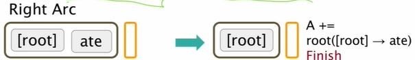
    - remove dependent from stack and add dependency to `A`.
    - only `[root]` on stack and empty buffer -> finish.

Con:

-   travel exponential size tree of possibilities. 
-   even dynamic programming reduce to $O(n^2)$.

### Machine learning based parser


-   machine learning classifier
    -   empirical.
    -   predicts the next step:
        -   shift
        -   left-arc
        -   right-arc
        -   ...
    -   high accuracy.
    -   no traversal at all.
    -   time complexity: $O(n)$.


