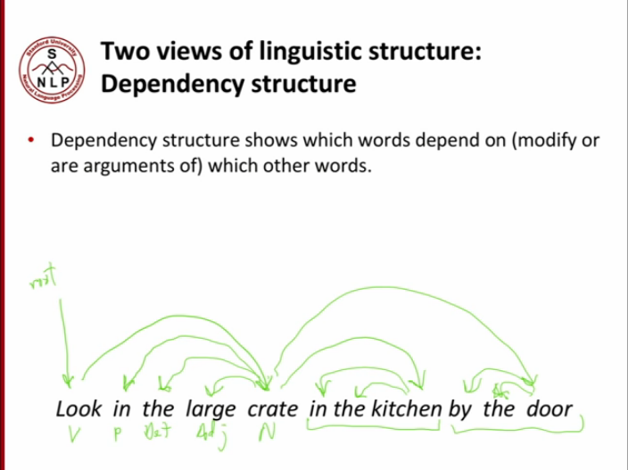
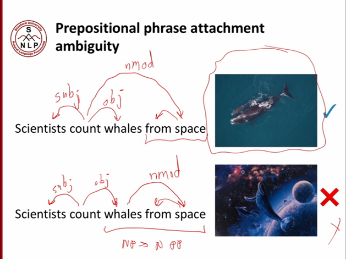
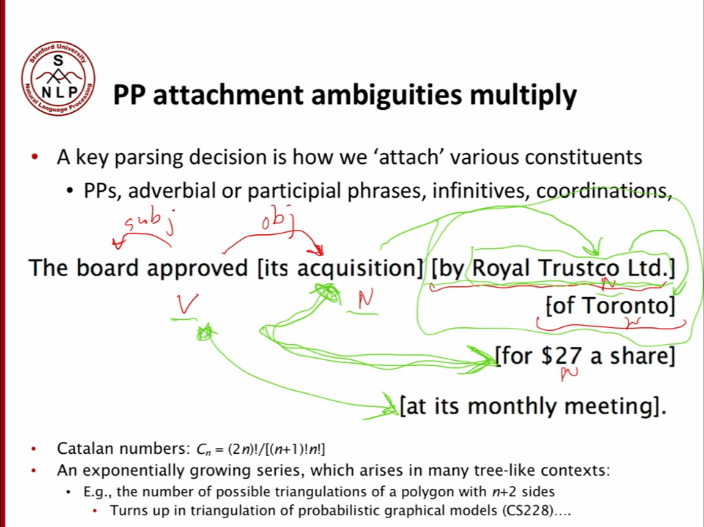
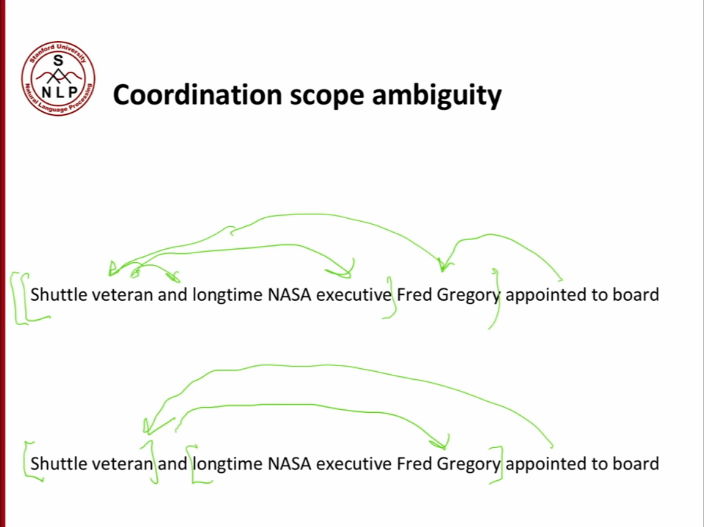
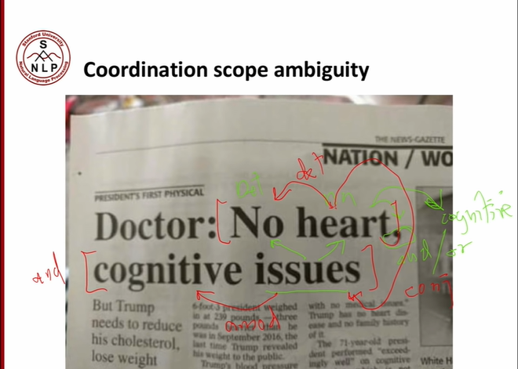
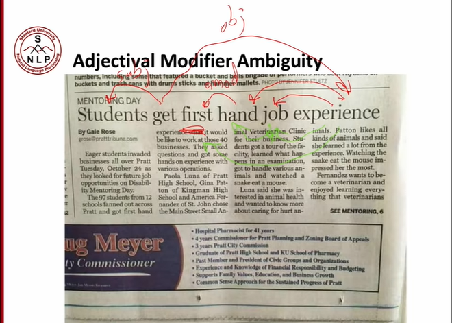

# Dependency Parsing

## Linguistic structure

-   Phrase structure grammar
    -   := context-free grammars
    -   unit := vertex of the tree
    -   ```
        NP -> Det N
            | Det Adj N
        ```
-   Dependency structure
    -   
        -   `[ ]` := sub unit
            -   either `{[ ]}` or `[] {}`, not allow `[ { ] }`?
        -   if a node has at least a child, the node itself could not be separated alone as a unit.
        -   valid units:
            -   `in kitchen`
                -   position
            -   `the kitchen`
                -   which kitchen
            -   `in the kitchen`
                -   position + which
            -   `in crate`
                -   position
            -   `the crate`
                -   which one
            -   `large crate`
                -   size
            -   `crate in the kitchen`
            -   `crate by the door`

-   Human communicate complex ideas by including words in structure.
-   Aim: `unit --{what connnects}-- other unit`.

## Ambiguity

### Prepositional phrase attachment Ambiguity

Prepositional phrase could be attached to different tokens.



```
                        kill
                 (subj)/    \(obj)   \ (nmod)
                      /      \         \
                   cops       man      knife
            /     /                  /
          /      /                  /
       San    Jose                 with
```

... cops using a knife to kill a man.

vs.

```
                        kill
                       /    \
                      /      \
                   cops       man
            /     /                 \ (nmod)
          /      /                    \   
       San    Jose                    knife
                                     /
                                    /
                                   with
```

... cops kill the man who was holding a knife.



-   exponential choices -> a lot of ambiguities

### Coordination scope ambiguity

Tokens of both sides around `and`, `or` or `,` want to govern the whole subtree.



```
Shuttle veteran and longtime NASA executive Fred Gregory appointed to board
```

```
                                                         appointed
                                                   /                  \
                                            Fred Gregory              board
             /                                                       /
        veteran                                                    to
       /                         \
Shuttle                           executive
                   /              /
                and          NASA
                           /
                    longtime
```

```
                                                         appointed
              /                                                       \
        veteran                                                       board
       /                                     \                       /
Shuttle                                     Fred Gregory           to
                   /                        /
                and               executive
                                 /
                             NASA
                            /
                    longtime
```



```
No heart, cognitive issues
```

```
                    issues
       /
   heart
  /      \
No        cognitive
         /
        ,
```

-   `,` := or.

```
   heart
  /                 \
No                  issues
         /         /
        , cognitive 
```

-   `,` := and.

### Adjectival modifier ambiguity

Adjective attached to different tokens.



```
Students get first hand job experience
```

```
         get
        /                  \
Students                    experience
                       /   /
                   hand job
           (amod) /
             first
```

-   `amod` := adjective modifier

```
         get
        /                  \
Students                    experience
                  /        /
             first      job
                       /
                   hand
```

### Verb Phrase (VP) attachment ambiguity


