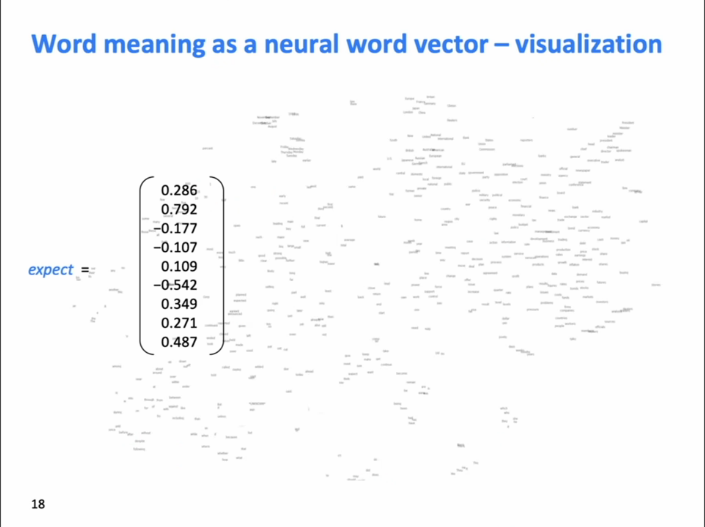
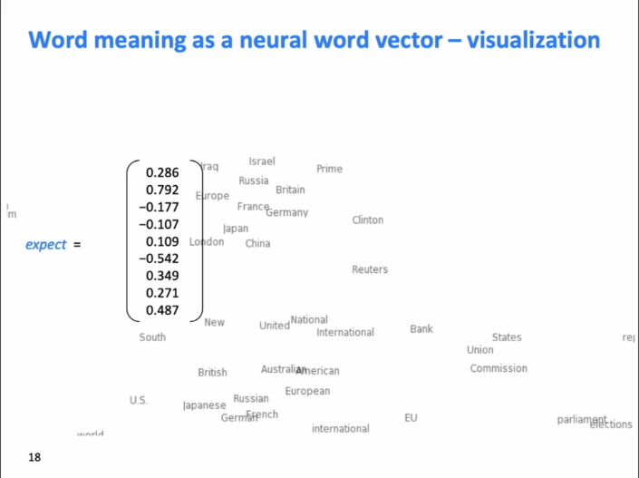
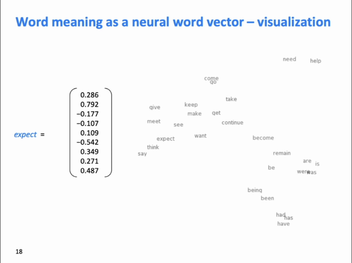
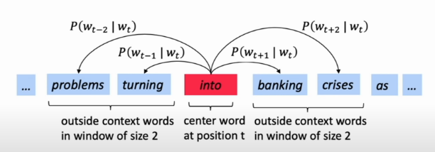
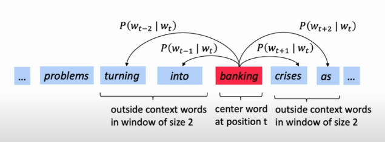
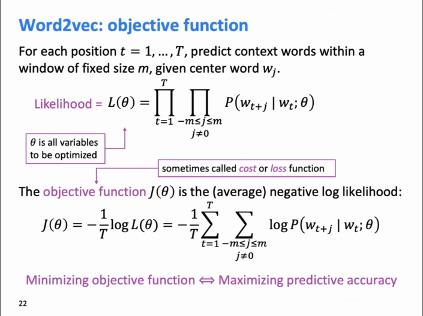

# Word Vectors

## Human Language & Words

-   Human vs orangutan

    -   Human language is the networking language in human computer network.
    -   Human team up
    -   writing -> make knowledge last long (accumulative?)

-   Human Language is slow

    -   -> compression information in communication by assuming subjects have mutual knowledge (common sense?)

-   Words
    -   := represent things
    -   How computer understands words? (relationships between words, meanings of words)
        -   use `WordNet`
            -   Synonym
        -   use `nltk`

## Words representations

### One-hot vectors

```python
motel = [0, 0, 0, 0, 0, 0, 0, 0, 0, 0, 1, 0, 0, 0, 0]
hotel = [0, 0, 0, 0, 0, 0, 0, 1, 0, 0, 0, 0, 0, 0, 0]
```

... those indexes represent respectively `house`, `cat`, `dog`, `some chairs`, `agreeable`, ...

Cons:

-   too many words -> too many indexes.
-   not showing the relationship between `motel` and `hotel`
    -   if showing the relationship by matrix -> matrix still too big

### By context

Distributional semantics: word's meaning <- mostly appear close-by

<pre>
...government debt problems turing into <b>banking</b> crises as happened in 2009...
    ...saying that Europe needs unified <b>banking</b> regulation to replace the hodgepodge...
            ...India has just given its <b>banking</b> system a shot in the arm...
</pre>

... the words around the `banking` is the meaning of `banking`.

### Word vectors

```python
banking = [0.286, 0.792, -0.177, -0.107, 0.109, -0.542, 0.349, 0.271]
```

-   dense vector
    -   not one-hot alike
-   distributed representation?
-   limited dimensions
    -   practically >= 50, namely 300, 1,000, 2,000, 4,000...
-   each word is a vector
-   all the words in a vector space
    -   
    -   different part (cluster) of the vector space has a pattern
        -   
        -   
        -   pattern: similarity
-   value of each dimension <- learned by algorithm. (black box)

## Word2vec

### Overview

To put all word vectors to the vector space in the proper location.

    

1.  Neural network: having `into` --{predict}--> `problems`, `turing`, `banking`, `crises`
1.  Change word vectors
1.  go to the next word 
1.  loop

### Objective function



-   Likelihood

    -   Time complexity = `O((T) * (2 * m))`
    -   Intuitive:

        ```csharp
        int m;  // given window size
        int T;  // given size of corpus
        double theta;  // given all hyper variables θ to be optimized
        int t;  // index of center word
        double likelihood = 1;

        // foreach (var word in the_corpus)
        for (t = 0; t < T; t++)
        {
            var center_word = corpus[t];
            int j;
            // for each context word within the window
            for (j = -m; j < m; j++)
            {
                // ignore center word
                if (j == 0)
                {
                    continue;
                }
                
                var context_word = corpus[t + j];
                likelihood *= P(context_word, center_word, theta)
            }
        }
        ```

-   objective function
    -   := a loss function
        -   aim to be minimized
    -   `-1` := the better prediction, the smaller loss
    -   `1 / T` := decouple with size of corpus
    -   `log()` always put on a product


