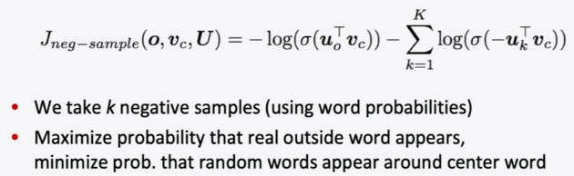
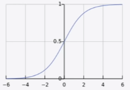
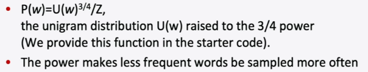
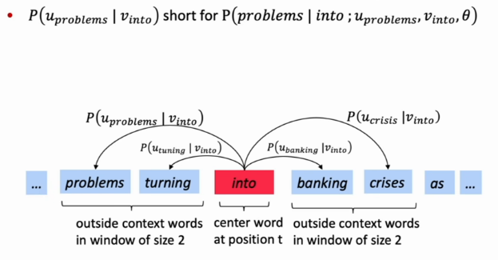
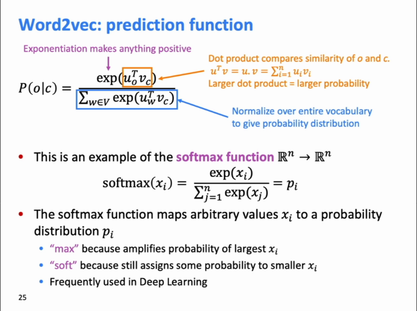
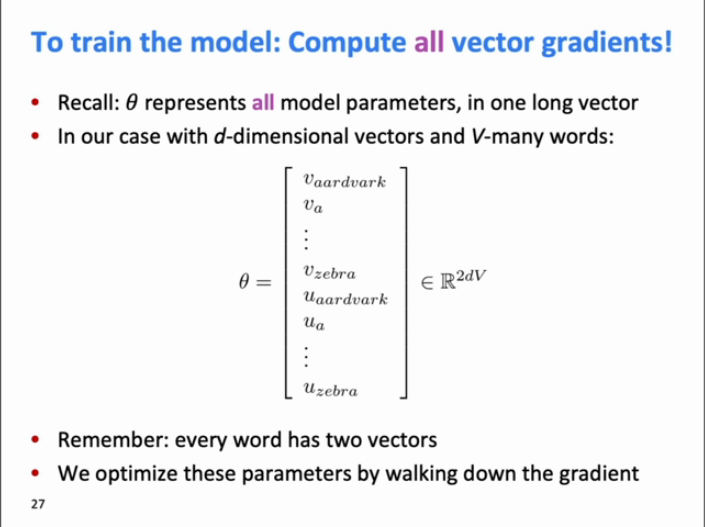
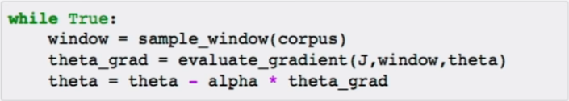
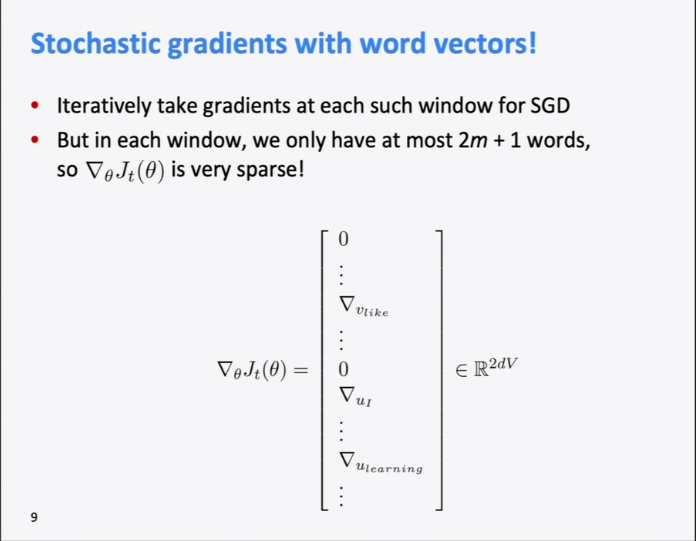

# Word Vectors

## Human Language & Words

-   Human vs orangutan

    -   Human language is the networking language in human computer network.
    -   Human team up
    -   writing -> make knowledge last long (accumulative?)

-   Human Language is slow

    -   -> compression information in communication by assuming subjects have mutual knowledge (common sense?)

-   Words
    -   := represent things
    -   How computer understands words? (relationships between words, meanings of words)
        -   use `WordNet`
            -   Synonym
        -   use `nltk`

## Words representations

### One-hot vectors

```python
motel = [0, 0, 0, 0, 0, 0, 0, 0, 0, 0, 1, 0, 0, 0, 0]
hotel = [0, 0, 0, 0, 0, 0, 0, 1, 0, 0, 0, 0, 0, 0, 0]
```

... those indexes represent respectively `house`, `cat`, `dog`, `some chairs`, `agreeable`, ...

Cons:

-   too many words -> too many indexes.
-   not showing the relationship between `motel` and `hotel`
    -   if showing the relationship by matrix -> matrix still too big

### By context

Distributional semantics: word's meaning <- mostly appear close-by

<pre>
...government debt problems turing into <b>banking</b> crises as happened in 2009...
    ...saying that Europe needs unified <b>banking</b> regulation to replace the hodgepodge...
            ...India has just given its <b>banking</b> system a shot in the arm...
</pre>

... the words around the `banking` is the meaning of `banking`.

### Word vectors

```python
banking = [0.286, 0.792, -0.177, -0.107, 0.109, -0.542, 0.349, 0.271]
```

-   dense vector
    -   not one-hot alike
-   distributed representation?
-   limited dimensions
    -   practically >= 50, namely 300, 1,000, 2,000, 4,000...
-   each word is a vector
-   all the words in a vector space
    -   
    -   different part (cluster) of the vector space has a pattern
        -   
        -   
        -   pattern: similarity
-   value of each dimension <- learned by algorithm. (black box)

## Word2vec

### Overview

To put all word vectors to the vector space in the proper location. 

1.  Neural network: having `into` --{predict}--> `problems`, `turing`, `banking`, `crises`
1.  Change word vectors
1.  go to the next word 
1.  loop

### Objective function


-   Likelihood

    -   Time complexity = `O((T) * (2 * m))`
    -   Intuitive:

        ```csharp
        int m;  // given window size
        int T;  // given size of corpus
        double theta;  // given all hyper variables θ to be optimized
        int t;  // index of center word
        double likelihood = 1;

        // foreach (var word in the_corpus)
        for (t = 0; t < T; t++)
        {
            var center_word = corpus[t];
            int j;
            // for each context word within the window
            for (j = -m; j < m; j++)
            {
                // ignore center word
                if (j == 0)
                {
                    continue;
                }

                var context_word = corpus[t + j];
                likelihood *= P(context_word, center_word, theta)
            }
        }
        ```

-   objective function
    -   := a loss function
        -   aim to be minimized
    -   `-1` := the better prediction, the smaller loss
    -   $\cfrac{1}{T}$ := decouple with size of corpus
    -   `log()` always put on a product
    -   Con: need to sum up the entire vocabulary.
        -   solution: the skip-gram model with negative sampling:
            -   
                -   $\sigma$ := sigmoid function
                    -   
                    -   $\sigma (x) = \cfrac {1} {1 + e ^{-x}}$
            -   intuitive goal:
                1.  take all the words that have shown up and give them big possibilities (scores);
                1.  and take negative sampling some random words that have not shown up and give them as small possibilities (scores) as possible.
                    -   `-1` in $-u_k^T v_c$: make random words with small possibilities (scores).
                        -   it flip the result by axis y in sigmoid.
                        -   Meaning `1 - possibility`.
            -   `K`: could be 10, 15 negative samples.
            -   How to sample?
                -   
                -   `w` := every word in the entire vocabulary.
                -   `P(w)` := the possibility of being picked as a negative sample word?
                    -   a probability distribution.
                -   `U(w)` sums up the count of the word for every word in the vocabulary.
                -   `Z`: the size of the entire vocabulary.
                    -   for normalization.
                    -   capital Z often means for normalization.

### Prediction function





-   $v_{w}$ := `w` is a **center word**
-   $u_{w}$ := `w` is a **context word**
-   `o` := a context word
-   `c` := a center word
-   `V` := entire vocabulary
    -   a symbol table
    -   a list having all words in the corpus
    -   has removed the replicas
-   `w` := every word in the entire vocabulary
-   The softmax function is a function that turns a vector of K real values into a vector of K real values that sum to 1

### Training model



-   shape of `θ` := `[2V, d]`
    -   in `θ` there are `2V` vectors
    -   each vector has `d` dimensions
-   `u` and `v` vectors are initialized randomly

Learn more from the backpropagation...

Gradient:

$$
\cfrac {\partial log(P(o | c))} {\partial v_c}
$$

$$
= u_o - \cfrac {\sum ^V _{x = 1} (e ^ {u ^T _o * v_c } * u_x)} {\sum ^V _{w = 1} e ^{u^T_w * v_c}}
$$

$$
= u_o - \sum ^V _{x = 1} (\cfrac {e ^ {u ^T _o * v_c }} {\sum ^V _{w = 1} e ^{u^T_w * v_c}} * u_x)
$$

$$
= u_o - \sum ^V _{x = 1} (P(x | c) * u_x)
$$

### Optimization

Stochastic Gradient Descent

-   Intuitive:

    

-   mini-batches
-   batch := a random window sample
-   Cons:
    -   some 32 batches have only hundreds distinct words but the entire vocabulary is way larger than that.
    -   
    -   solution
        -   assign selected rows to the slices of `theta_grad`? or `theta`?

### Details

Why two `u`, `v` vectors for the same word in $\theta$?

-   easy to calculate $\cfrac {\partial log(P(o | c))} {\partial v_c}$
-   since the dot product is symmetric, the two vectors are close to each other. later take the average of the two vectors

Two model variants (training logic):

-   Skip-grams (SG)
    -   predict context words (position independent) given center word.
-   Continuous Bag of Words (CBOW)
    -   predict center word from the bag of context words

... Skip-gram model is selected.
