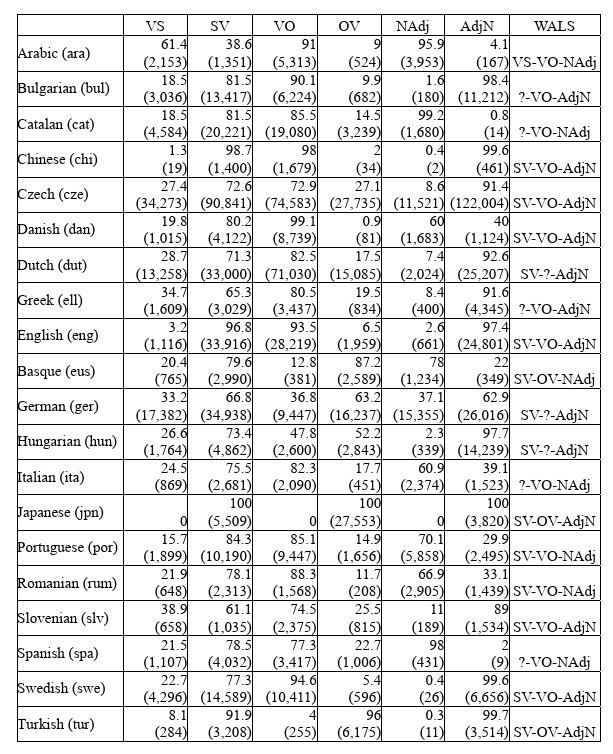
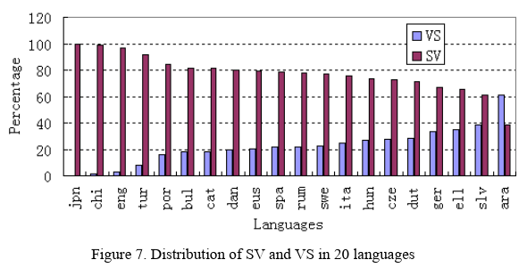
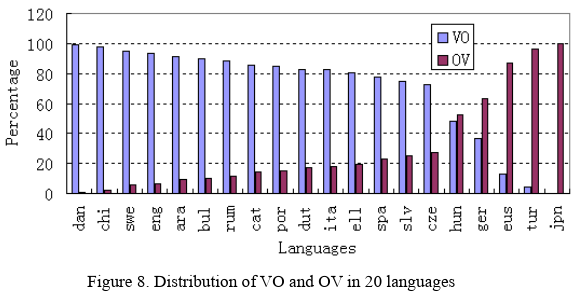
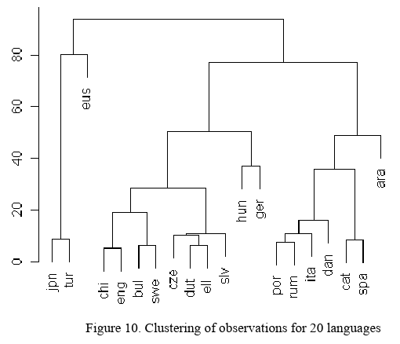
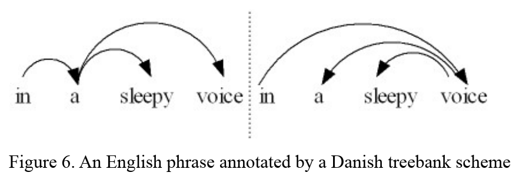
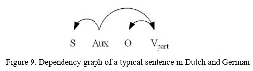

# 依存方向

## WALS

WALS := the dominant word order of the language.

-   
-   `SV` := 先 subj 后 verb
-   `OV` := 先 obj 后 verb 

## 语言 POS 元素之间的 linear 顺序

-   基于 SV-OV-AdjN 顺序。

## 语言相同 pos pairs 使用不同的依赖方向

> Not so sure.

-   left: Danish parser
-   right: English parser
-   在 parsing 的时候，会以 POS 作为依赖参考？

## References

- <https://doi.org/10.1016/j.lingua.2009.10.001>
