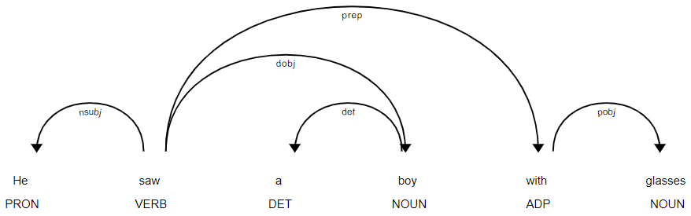
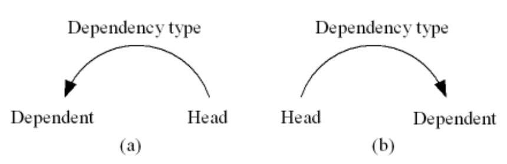

# Dependency Grammar

## Dependency Grammar Structure

也就是 Dependency Grammar 的语法树。

例子：

    He saw a boy with glasses.

... 转化为语法树为:

```
           saw
       /         \
    He            boy
                /     \
               a      with
                         \
                        glasses
```

-   
-   `boy` is the governor (head) to `with` while `with` depends on `boy`.
-   `saw` is the root.

degree := fan-out, i.e. the number of the children of a parent.

degree centrality := 某个 vertex (node) 有比较大的 fan-out.

level 意义与图论的相似，从 0 开始算起？

index 0 是一个 dummy，只指向 `saw`。剩下 index 按照阅读顺序分配。index 是线性位置。



-   A dependency pair is head-initial if its head precedes the dependent.
-   it is head-final if the head follows the dependent.
