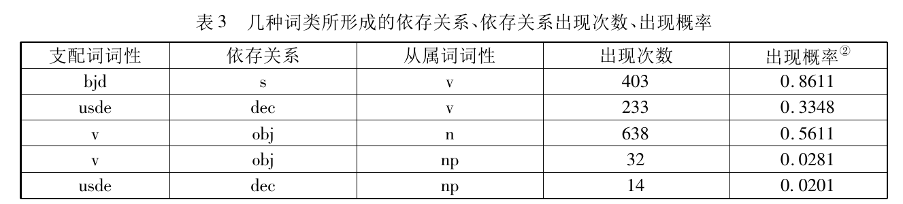

# Valency Pattern

## Definition

……拓展到形容词和名词领域

### Verb

-   零价动词：不强制要求与某种性质的名词性词语关联的一类动词。可记为动$^0$。例如“地震、刮风、下雨”等。这类动词大多反映自然现象。这类动词可以和表处所、方位的名词性短语一起出现，但那些并非是动词的直接关联成分。在汉语等语言中，这类动词可以单独成句，不需要主语，例如“刮风了。”、“下雨了。”。而在英语中，这类动词需要添加形式主语it，如“It rains.”
-   一价动词：强制要求与一种性质的名词性词语关联的一类动词。可记为动$^1$。例如“病、醉、休息、游泳”等。这类动词差不多就是一般说的不及物动词（自动词）。
-   二价动词：强制要求与两种性质的名词性词语关联的一类动词。可记为动$^2$。例如“爱、采、参观、讨论”等。这类动词差不多就是一般说的（单）及物动词（他动词）。
-   三价动词：强制要求与三种性质的名词性词语关联的一类动词。可记为动$^3$。例如“给、告诉、买”等。这类动词差不多就是一般说的双及物动词，日语的授受动词属于这一类。[1]
-   四价动词：强制要求与四种性质的名词性词语关联的一类动词。例如：“我$^1$跟你$^2$‘打赌’三百块$^3$明天会下雨$^4$”，这里“打赌”就可以视为四价动词。这种动词很不常见。

### Dependency Title

-   v --{subj}--> n
-   v --{obj}--> n
-   v --{adj}--> adj?

### References

-   基于概率配价模式理论的花园幽径句研究
