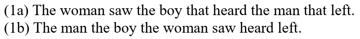
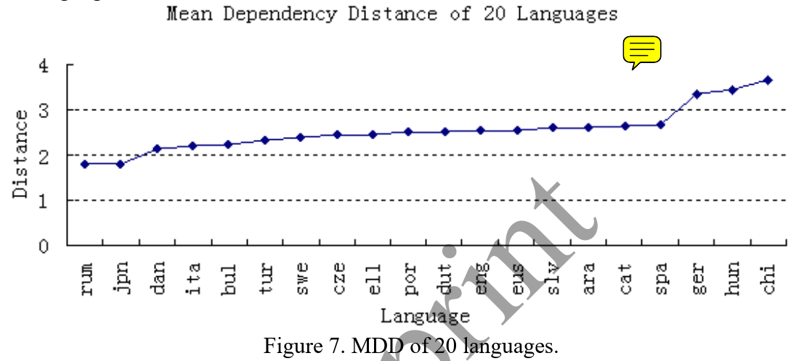

# Working Memory

## Hypothesis

### Depth Hypothesis

-   the maximum number of symbols needed to be stored during the construction of a given sentence” as the depth of that sentence

    -   depth of the parsing stack

-   Depth Hypothesis
    1. Although all languages have a grammar based on constituent structure,
    1. the sentences actually used in the spoken language have a depth that does not exceed a certain number
    1. equal or nearly equal to the span of immediate memory
    1. (presently assumed to be 7±2). (d) The grammars of all languages will include methods for restricting regressive constructions so that most sentences will not exceed this depth...

### Early Immediate Constituents (EIC)

> ???

The human parser prefers linear orders that maximize the IC-to-non-IC ratios of constituent recognition domain.

#### “Minimize Domain” (MiD)

"The human processor prefers to minimize the connected sequences of linguistic forms and their conventionally associated syntactic and semantic properties in which relations of combination and/or dependency are processed.

### Dependency Locality Theory (DLT).

-   Resources are required for two aspects of language comprehension:
    -   storage of the structure built thus far and
    -   integration of the current word into the structure built thus far.
-   The structural integration complexity depends on the distance or locality between the two elements being integrated

### EIC + DLT

-   The human language parser prefers linear orders that minimize the average dependency distance of the recognized sentence or the text.
-   There is a threshold that the average dependency distance of most sentences or texts of human languages does not exceed.
-   Grammar and cognition combine to keep dependency distance within the threshold.

### dependency-length minimization

principles of dependency-length minimization in grammar:

-   dependencies should be consistently right-branching or left-branching; 
    -   ?
-   shorter dependent phrases should be closer to the head; 
-   some “opposite-branching” of one-word phrases is desirable.
    -   ?

## Parsing for human

incremental parsing strategy

1. W <- inputSequence[i]
1. W.dependents.Add(headList[j])
1. headList.Remove(j)
1. if (W is wordList[k].dependent)
    1. wordList[k].dependents.Add(W)
1. else
    1. headList.Add(W)
1. wordList.Add(W)

```python
# W is each word in the sentence `inputSentence`
for W in inputSentence:
    # add W to wordList.
    wordList.Add(W)
    # the following for-loop is to find out W's dependents from headList
    # j each time assigns 0, 1, ..., <current size of headList> - 1.
    for j in range(headList.Size):
        # judge if the j-th word in headList is the dependent of W.
        if (headList[j] is W.dependent):
            # assign the j-th word to the set of dependents under W.
            W.dependents.Add(headList[j])
            # remove the j-th word from headList
            headList.Remove(j)
    # initiate status that W has not found a governor
    hasWFoundGovernor = False
    # the following for-loop is to find out W's governor from wordList
    # k each time assigns 0, 1, ..., <current size of wordList> - 1.
    for k in range(wordList.Size):
        # judge if W is the dependent of the k-th word in wordList.
        if (W is wordList[k].dependent):
            # assign W to the set of dependent under the k-th word in wordList.
            wordList[k].dependents.Add(W)
            # W has found its governor
            hasWFoundGovernor = True
            # skip to the next W
            break
    # if W has not found its governor
    if (not hasWFoundGovernor):
        # add W to headList.
        headList.Add(W)
```

-   `headList` is the working memory.
-   `headList` := currently found heads.
-   best case: $O(n)$
    -   steps in visiting wordList might be skipped.
-   average case: $O(n logn)$?
    -   the number of steps in visiting wordList might only be $logn$
        -   可能更像是人脑的工作方式。
-   worst case: $O(n^2)$
    -   suppose `headList[j] is W.dependent` and `W is wordList[k].dependent` are $O(1)$.
-   worst case: $O(n^3)$
    -   suppose `headList[j] is W.dependent` and `W is wordList[k].dependent` are $O(n)$.

Human parsing vs time complexity

-   paper
    -   <https://www.jstor.org/stable/4178272>
        -   <http://alpha-leonis.lids.mit.edu/wordpress/wp-content/uploads/2014/05/berwick-weinberg-li-1982.pdf>
    -   <https://web.stanford.edu/~mjkay/covington.pdf>
-   slides - <https://www.inf.ed.ac.uk/teaching/courses/inf2a/slides2016/inf2a_L27_slides.pdf>
-   dependency parsing vs constituency parsing
    -   > <https://linguistics.stackexchange.com/a/6890>
    -   

### Dependency density

-   a dependency is open := the head of the dependent has still not been found. The dependent is in the `headList`.
-   Dependency density := 每读一个词，sum 一下当前的 `headList.Size`。

### My guesses

New measure for DD:

-   遗忘曲线。
    -   每个在 headList 的玩意都给标个 R 值。
    -   暂时改进方案：
        -   _
            -   节拍
                -   一个时间单位。
                -   每次出现 从右到左的箭头，节拍++
-   相连元素容易同时记忆。无关元素难以同时记忆。
    -   相连 := dependency.
    -   暂时改进方案：
        -   _
            -   同一个 root 下面的所有元素 R 值 == root.R.
-   新的 DD 计算方式
    -   _
        -   dependent 还作为 head 的时候，R 值下降的总额。
    -   _
        -   不计算从左往右的依赖距离。
            -   只计算从右往左的依赖距离。
            -   计算从左往右的依赖距离也是可以的。
            -   主要依据:
                -   计算 `headList[j] is W.dependent` and `W is wordList[k].dependent` 的 time complexity.
                -   人倾向于 parse 从左往右
                -   意识流比较容易 parse
                -   从句比 and 复合句难 parse
        -   每个依赖距离都需要 square 一下。
            -   Pros:
                -   符合 $O(n^2)$ 的 time complexity expectation.
                    -   很有可能只是巧合而已
                -   重点惩罚比较远的依存距离。
                -   MDD 表达的是 space complexity, O(n)，所以也符合预期。
                    -   很有可能只是巧合而已
                    -   MDD 大量被称为 complexity 的度量，其实只是 space 层面的，不应该是 time 层面的
                    -   _
                        -   suppose:
                            -   $n$ is the length of a sentence
                            -   $n$ grows
                        -   SDD grows matches $O(nlogn)$, **might** (not necessary) represent space complexity.
                        -   MDD grows slower than $O(n)$, **might** represent time complexity.
            -   Cons:
                -   $O(nlogn)$ 指的是从无语法树到有语法树的大概时间复杂度。
                -   现在是 given 语法树，计算具体的复杂度。
                -   人脑可能能够做到 $O(nlogn)$?
    -   L Lei
        -   <https://www.tandfonline.com/doi/full/10.1080/09296174.2018.1504615>
-   


测试用例子：

```
I am a psycho to whom she talks.

I am a psycho and she talks to the psycho.
```

New parsing algorithm:

-   经验
    -   `W` 会被直接放到具体的 relative level.
        -   relative to a clause. 这个 level 指的是在一个 clause 里面的 level。
    -   一般能够猜测 `W` 应该放置在 level 0-1.

### Late Closure principle

```
After the student moved the chair broke.
```

-   Late Closure principle := “the chair” is initially interpreted as the object of the verb “moved”.

the more structured the material to be remembered, the less burden the material will place on immediate memory

-   -> Late Closure has the effect of reducing the parser’s memory load".

## Definitions



-   (1a) right-branching structure.
    -   MDD small
    -   easy to parse.
-   (1b) center-embedded structure.
    -   MDD big
    -   hard to parse.

## Findings



-   threshold == 4.

Based on the above discussions, we can conclude that:

-   MSL,
    -   msl := the mean sentence length
-   no-crossing arc,
-   grammar and 
-   dependency link between adjacent words

...contribute together to influence and reduce MDD of a sentence (language).

Based on these discussions and experiments, we argue that **the annotation scheme** does influence MDD, but that this effect is not strong enough to affect the conclusion seriously.

## References

-   <https://doi.org/10.17791/jcs.2008.9.2.159>
-   online tools for universal dependencies - <http://lindat.mff.cuni.cz/services/udpipe/>
