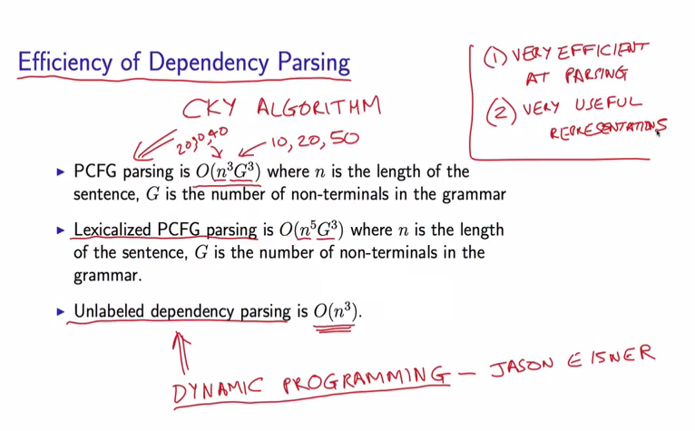

# Working Memory

## Hypothesis

### Depth Hypothesis

-   the maximum number of symbols needed to be stored during the construction of a given sentence” as the depth of that sentence

    -   depth of the parsing stack

-   Depth Hypothesis
    1. Although all languages have a grammar based on constituent structure,
    1. the sentences actually used in the spoken language have a depth that does not exceed a certain number
    1. equal or nearly equal to the span of immediate memory
    1. (presently assumed to be 7±2). (d) The grammars of all languages will include methods for restricting regressive constructions so that most sentences will not exceed this depth...

### Early Immediate Constituents (EIC)

> ???

The human parser prefers linear orders that maximize the IC-to-non-IC ratios of constituent recognition domain.

#### “Minimize Domain” (MiD)

"The human processor prefers to minimize the connected sequences of linguistic forms and their conventionally associated syntactic and semantic properties in which relations of combination and/or dependency are processed.

### Dependency Locality Theory (DLT).

-   Resources are required for two aspects of language comprehension:
    -   storage of the structure built thus far and
    -   integration of the current word into the structure built thus far.
-   The structural integration complexity depends on the distance or locality between the two elements being integrated

### EIC + DLT

-   The human language parser prefers linear orders that minimize the average dependency distance of the recognized sentence or the text.
-   There is a threshold that the average dependency distance of most sentences or texts of human languages does not exceed.
-   Grammar and cognition combine to keep dependency distance within the threshold.

### dependency-length minimization

principles of dependency-length minimization in grammar:

-   dependencies should be consistently right-branching or left-branching; 
    -   ?
-   shorter dependent phrases should be closer to the head; 
-   some “opposite-branching” of one-word phrases is desirable.
    -   ?

## Parsing for human

incremental parsing strategy

1. W <- input[i]
1. W.dependents.Add(headList[j])
1. headList.Remove(j)
1. if (W is wordList[k].dependent)
    1. wordList[k].dependents.Add(W)
1. else
    1. headList.Add(W)
1. wordList.Add(W)

```python
for W in input:
    for j in range(headList.Size):
        if (headList[j] is W.dependent):
            W.dependents.Add(headList[j])
            headList.Remove(j)
    for k in range(wordList.Size):
        if (W is wordList[k].dependent):
            wordList[k].dependents.Add(W)
        else:
            headList.Add(W)
    wordList.Add(W)
```

-   `headList` is the working memory.
-   `headList` := currently found heads.
-   $O(n^2)$
    -   suppose `headList[j] is W.dependent` and `W is wordList[k].dependent` are $O(1)$.

Human parsing vs time complexity

-   paper
    -   <https://www.jstor.org/stable/4178272>
        -   <http://alpha-leonis.lids.mit.edu/wordpress/wp-content/uploads/2014/05/berwick-weinberg-li-1982.pdf>
    -   <https://web.stanford.edu/~mjkay/covington.pdf>
-   slides - <https://www.inf.ed.ac.uk/teaching/courses/inf2a/slides2016/inf2a_L27_slides.pdf>
-   dependency parsing vs constituency parsing
    -   > <https://linguistics.stackexchange.com/a/6890>
    -   

### Dependency density

-   a dependency is open := the head of the dependent has still not found. The dependent is in the `headList`.
-   Dependency density := 每读一个词，sum 一下当前的 headList.Size。

### My guesses

New measure for DD:

-   遗忘曲线。
    -   每个在 headList 的玩意都给标个 R 值。
-   相连元素容易同时记忆。无关元素难以同时记忆。
    -   相连 := dependency.
    -   暂时：同一个 root 下面的所有元素 R 值 == root.R.
-   新的 DD 计算方式
    -   dependent 还作为 head 的时候，R 值下降的总额。

New parsing algorithm:

-   经验
    -   `W` 会被直接放到具体的 relative level.
        -   relative to a clause. 这个 level 指的是在一个 clause 里面的 level。
    -   一般能够猜测 `W` 应该放置在 level 0-1.

### Late Closure principle

```
After the student moved the chair broke.
```

-   Late Closure principle := “the chair” is initially interpreted as the object of the verb “moved”.

the more structured the material to be remembered, the less burden the material will place on immediate memory

-   -> Late Closure has the effect of reducing the parser’s memory load".

## Definitions


-   (1a) right-branching structure.
    -   MDD small
    -   easy to parse.
-   (1b) center-embedded structure.
    -   MDD big
    -   hard to parse.

## Findings


-   threshold == 4.

Based on the above discussions, we can conclude that:

-   MSL,
    -   msl := the mean sentence length
-   no-crossing arc,
-   grammar and 
-   dependency link between adjacent words

...contribute together to influence and reduce MDD of a sentence (language).

Based on these discussions and experiments, we argue that **the annotation scheme** does influence MDD, but that this effect is not strong enough to affect the conclusion seriously.

## References

-   <https://doi.org/10.17791/jcs.2008.9.2.159>
