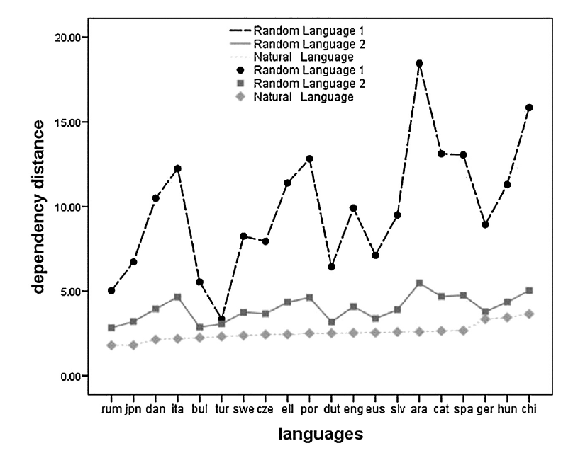
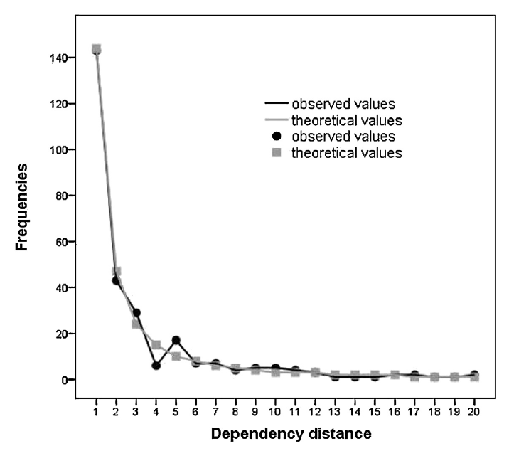
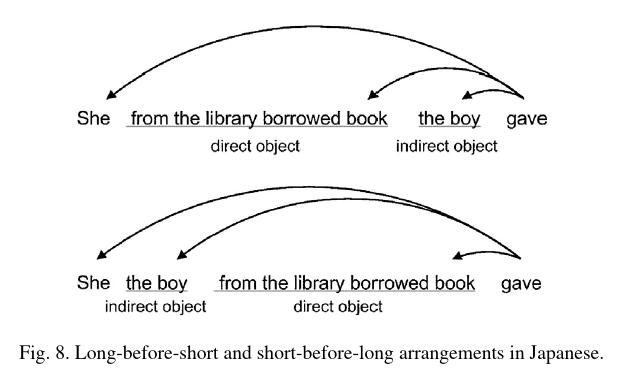
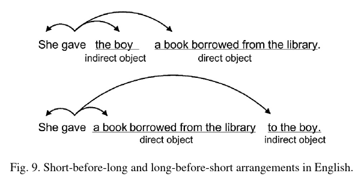
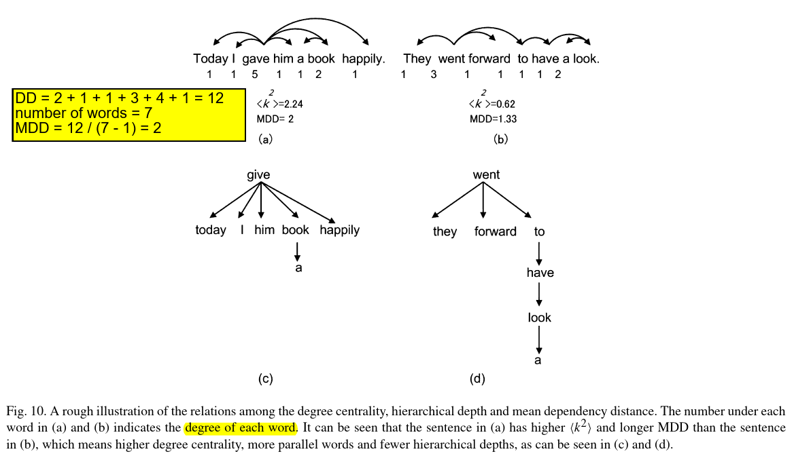
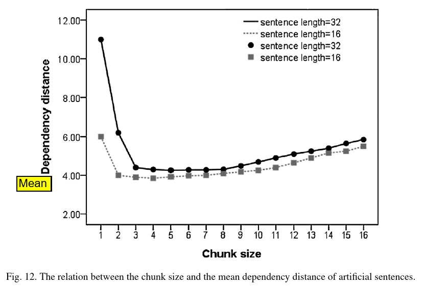
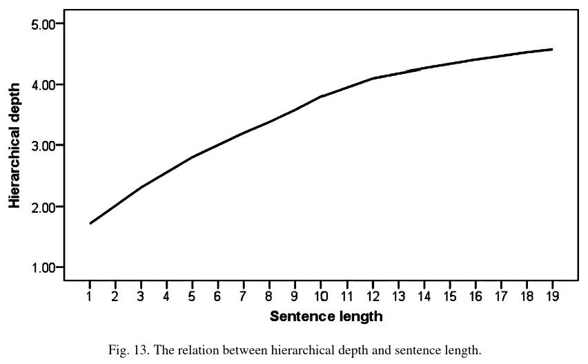
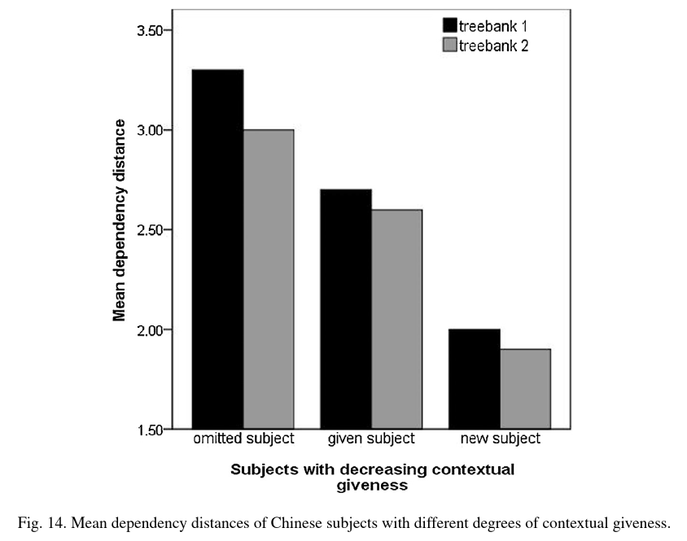

# Dependency Distance

## Definitions

### Dependency Grammar Structure

也就是 Dependency Grammar 的语法树。

例子：

    He saw a boy with glasses.

... 转化为语法树为:

```
           saw
       /         \
    He            boy
                /     \
               a      with
                         \
                        glasses
```

`boy` is the governor to `with` while `with` depends on `boy`.

`saw` (the root) is the head.

degree := fan-out, i.e. the number of the children of a parent.

degree centrality := 某个 vertex (node) 有比较大的 fan-out.

level 意义与图论的相似，从 0 开始算起？

### Dependency Distance

Dependency Distance 是从语言中**人为**提取出来的概念。

Dependency Distance := 两个**有直接关联**的词之间 in-order 距离

-   直接关联指的是在语法树中为 parent-child 的关系。

### Mean of Dependency Distance (MDD)

<!-- $$
MDD (sentence) = \frac{1}{n - 1} * \sum_{i = 1}^{n} |DD_{i}|
$$ -->


-   `n` := the total number of words in a text
<!-- - $DD_i$ := 第 i 对 parent-child 的 Dependency Distance -->
-    := 第 i 对 parent-child 的 Dependency Distance

<!-- $$
MDD (text) = \frac{1}{nW - s} * \sum_{i = 1}^{nW} |DD_{i}|
$$ -->


-   `nW` := the total number of words
-   `s` := the total number of sentences

### Dependency Distance Minimization (DDM)

语言的 Dependency Distance 倾向于最小化的一种**现象**。

### Working Memory

与 cache 类似，有 time locality 的现象？

记忆的 words 会被新记忆内容覆盖？

多次访问的记忆会降低访问难度？这表现为 locality ？

#### Dependency Locality Theory (DLT)

word 的 activation 程度会随时间 decay

locality effect := 因为 activation 会随着时间 decay，那么 DD 比较长的就比较难

如果 intervening words 比较容易通过脑子处理，那么 activation 就比较会降少一点

-   pronouns 比较多作为 intervening words

#### Probabilistic Valency Pattern (PVP)

容易预测到的 words 可以降低 access 的难度

在 B 存在的情况下， B governs A 的可能性：

```
P (A ← B | B)
```

在 B 存在的情况下， B depends on A 的可能性：

```
P (A → B | B)
```

... 简单来说，就是 words 之间的相互关联程度呗。

### Projection vs Non-projection

Non-projection (crossing dependency) := in-order traversal 的结果**不等于**语句阅读结果。

Projection := in-order traversal 的结果**等于**语句阅读结果。

### SVO vs SOV

SVO (VO) := 宾语放在动词后面

SOV (OV, head-final, post-verbal) := 动词放在宾语后面

## Facts

-   DDM is human-driven
-   treebanks 是一种 corpus 数据
-   人类语言普遍往 DDM 发展
    -   working memory 记忆词语的难度随着 DD 的增大而增加
    -   
    -   取样自中文文章 <br>
        
    -   句子内部的元素会以 DDM 为目标排序
        -   
            -   long-before-short 的 MDD 比较低，所以这种比较经常出现在 SOV
        -   
            -   short-before-long 的 MDD 比较低，所以这种比较经常出现在 SVO
    -   语言一般来说会从 OV -> VO
        -   OV 一般来说他的 MDD 比 VO 的大
        -   Non-projection 的 MDD 必须大，在实际语言上少见
-   depth 越大，MDD 越小
    -   
-   比较少的情况，语言存在 MDD 比较大的现象，但是一般来说会有对应手段来尽量降低记忆难度
    -   短句子由于有比较大的 degree centrality，MDD 反而比较大，但是毕竟句子太短，DD 总数不大
        -   
        -   
    -   SOV 比较多出现在语言原始阶段
        -   SOV 比较容易搞混 S 和 O
        -   SOV 的语言下，如果 O 比较长，语言仍然倾向于用 SVO 表达
            -   长 O 会影响 V-S 依赖的强度
        -   SOV 的 V 比较简单，容易 predict，所以抵消 DD 比较大的记忆问题
        -   SOV 通过省略 argument 来降低 MDD (corpus 发现 SOV 较多使用 intransitive verb (不及物动词))
        -   sentence markers that indicate interrogation, negation, etc., are often placed before verbs in VO languages, and after verbs in OV languages, which gradually lead to a regular pattern of agglutinative structures in OV languages, and inflectional structures in VO languages
        -   corpus 里面发现 SOV 的 MDD 不会太大
    -   为了 reliability, coherence，存在 MDD 比较大的情况，但是也会有相应措施降低 MDD
        -   pronouns 比较多作为 intervening words
            -   如果 intervening words 比较容易通过脑子处理，那么 activation 就比较会降少一点
        -   人本来就比较容易记住开头和结尾的 items，所以横跨开头和结尾的 DD 也比较容易记忆
        -   汉语 (VO 语序) 的依存距离是最长的
        -   经常访问的 words 更加容易记住和不容易忘记，所以跟这个 words 相关的 DD 可以比较长
            -   
        -   多用可预测的 DD 组合
            -   容易预测到的 words 可以降低 access 的难度

## References

-   <https://doi.org/10.1016/j.plrev.2017.03.002>
